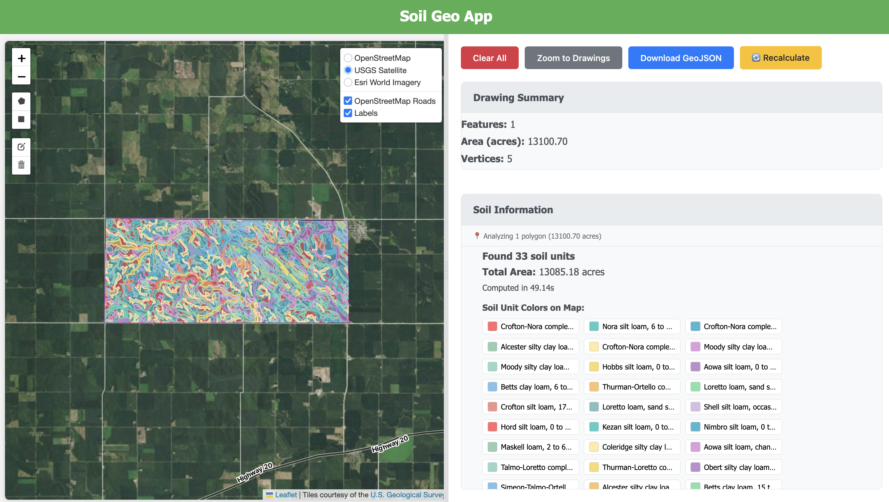

# US Geo Info — Soil Analysis App

A Vue.js application for analyzing soil information within user-drawn geographic boundaries using the USDA Soil Data Access (SDA) API.



Caption: Example analysis of a drawn polygon with color-coded soil units and a right-side results panel (see `images/Screenshot.png`).

---

## Overview

This interactive web app lets users draw polygons on a map and instantly analyze soil characteristics for those areas. It queries the USDA SDA API to retrieve soil map units and aggregate properties such as taxonomic classification, drainage, pH, organic matter, texture, and area.

## Quick highlights

- Interactive Leaflet map with multiple base layers
- Draw, edit and delete polygons with Leaflet Draw
- Background processing via a Web Worker to keep the UI responsive
- Area-weighted aggregation of soil properties
- GeoJSON export of drawn geometries and results

## Features

- Multiple basemap options: OpenStreetMap, USGS Satellite, Esri
- Polygon drawing and editing tools
- Real-time soil data fetching and processing with progress reporting
- Color-coded soil-unit visualization on the map
- Detailed soil property tables and area summaries
- Export/Download GeoJSON of drawn areas

## Tech stack

- Frontend: Vue.js 3 (Composition API)
- Mapping: Leaflet.js + Leaflet-Draw
- Geospatial: Turf.js, polygon-clipping, wellknown
- Build: Vite
- Optional backend: Express.js (static serving for production)

## Quick start (development)

1. Install dependencies:

```bash
npm install
```

2. Run the dev server:

```bash
npm run dev
```

3. Open your browser at http://localhost:5173 (Vite default) and draw a polygon on the map.

Notes:
- For a production build use `npm run build` and serve the `dist/` folder. A small Express server is included for static serving.

## Project layout (important files)

```
src/
├── App.vue          # Main Vue component (map, drawing UI)
├── main.js          # Vue app entry
└── soil.worker.js   # Background worker for soil analysis
workers/
└── soil.js          # Core soil analysis engine (WKT conversion, SDA queries, aggregation)
examples/
├── example_1.js     # Node.js example of soil analysis
└── example_1.ipynb  # Python notebook demonstration
images/
└── Screenshot.png   # Example app screenshot (added to README)
```

## API integration (high level)

The project uses USDA Soil Data Access (SDA) endpoints to locate and retrieve soil map units and polygon geometries. Common calls include:

- SDA_Get_Mukey_from_intersection_with_WktWgs84 — find map unit keys intersecting a polygon
- SDA_Get_MupolygonWktWgs84_from_Mukey — retrieve polygon WKT for a map unit

Additional SQL queries combine SSURGO tables to return descriptive soil attributes.

## Scripts

- `npm run dev` — start Vite dev server
- `npm run build` — build production bundle (outputs `dist/`)
- `npm run preview` — preview the production build

## Troubleshooting tips

- Map not rendering: verify Leaflet and Leaflet-Draw are loaded, check console for errors
- Drawing issues: confirm Leaflet-Draw version compatibility
- API timeouts: the SDA API can be slow for large polygons; reduce complexity or split areas

## Contributing

1. Fork the repo
2. Create a feature branch
3. Add tests where appropriate
4. Open a PR with a clear description

## License

This project is available under the MIT License — see the `LICENSE` file.

## Acknowledgments

- USDA Soil Data Access (SDA)
- OpenStreetMap contributors
- USGS and Esri for imagery layers
